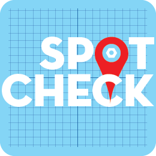

<style>
  .logo {width: 75px;}
  .center {display: flex; 
          flex-direction: column;
          align-items: center;
          }
  .title {
        color: #005a9c;
        font-size: 18px;
  }
  .header {
        text-decoration: underline;
        font-weight: 500;
  }
</style>

<div class="center">

<strong><p class="title">Spot Check</p></strong>
</div>

<h3 class="header">Overview</h3>

Spot Check utilizes Google Maps to allow users to plot skateboard spots using their real latitude and longitude. Users can then rate and review each spot and "favorite" the spots they like best. Using the "Nearby Spots" feature, a user can add a location and find the closest spots to that location.

### <strong>Requirements</strong>

- Ruby 2.7.4
- NodeJS (v16), and npm
- Postgresql


<h3 class="header">Installation</h3>

1. Create a Google Maps API key <a href="https://developers.google.com/maps/documentation/javascript/get-api-key">here</a>. This key will be used later to allow full access of Spot Check. Google will want you to set up a "project" with a billing account. "Billing setup is required for each project, but you will only be charged if a project exceeds its quota of no-charge services."

2. Next clone this git and cd into the directory you create.
   ```
   -git clone git@github.com:jedwardmook/spot-check-app.git your-directory-name
   -cd your-directory-name
   ```

3. Install necessary dependencies and create the database.
   ```
   -bundle install
   -rails db:create
   -npm install --prefix client
   ```

4. Create a `.env.local` file in the client folder. Inside this file place your Google Maps API key. The MapsContainer will use this key to verify your access.
    ```
    YOUR-DIRECTORY-NAME>SRC

    REACT_APP_GOOGLE_MAPS_API_KEY="the_key_you_created"
    ```
  
5. Finishing setting up the environment by migrating and seeding the database. Start the server, and then open a new terminal and launch the frontend.
    ```
    -rails db:migrate
    -rails db:seed
    -rails s
    ```
    ```
    npm start --prefix client
    ```

<h3 class="header">Functionality</h3>
<strong>Adding a Spot</strong>
<p>Once a User is logged in, they have access to the Spot Map. By clicking the location on the map, the User is giving the option to "Add spot here". Clicking "Yes" redirects a User to the Add Spot form. A User fills out the form, and a Spot is created. This Spot now has it's own dedicated page and Marker on the Spot Map. Spots must has a name to be created.</p>
<strong>Reviewing a Spot</strong>
<p>To review a Spot, click "Add Review" at the top of the Spot's page. This will bring up the "Add Review" form. Fill out the form and click the "Submit" button. The User's review will now be viewable on the Spot's page and on the User's profile. Review's must have a "Rating" and "Bust" rating to be submitted.</p>
<strong>Favoriting a Spot</strong>
<p>A User can Favorite a Spot by clicking the empty heart in the upper right of the Spot's page. After favoriting the Spot, it will be added to their favorites array. This array is viewable on the Spot Map denoted with their own special favorite marker by clicking "Show Favorites" in the User Menu. A Favorite can be removed from the list by clicking the now filled heart in the upper right of the Spot page and confirming.</p>
<strong>Editing</strong>
<p>A User can edit a their profile and any Spot or Review they have created. Profiles are editing by clicking "Edit Profile" on the profile page and completing the form. Spots are edited from their page by clicking "Edit Spot" and completing the form. A User's Review is editable on the Spot page the Review is concerning. Clicking "Edit Review" will bring up a form to be completed. Only one Review per User is allowed per Spot.</p>

### <strong>Technologies Used</strong>
- <strong>Ruby on Rails
- React
- Sass</strong>